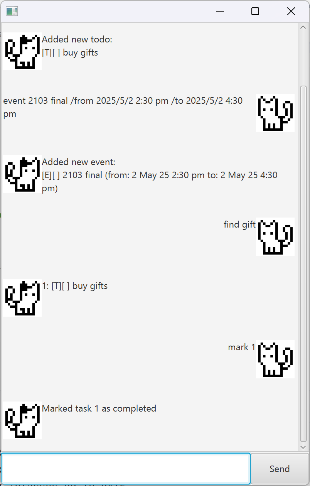

# Luna User Guide



Luna is a minimalist task management tool that allows users to organize todos, deadlines and events.
It is a command-line interface (CLI) application run on a minimalist Graphical User Interface (GUI) on the user's computer.
The user can add their tasks and deadlines, mark/unmark tasks as done, delete tasks, and list all their tasks, with persistent data across sessions.

## Viewing help: `help`

Shows the exhaustive list of commands, description and required syntax.

> [!NOTE]
> Entering and invalid command will result in a prompt to use `help`.

## Exiting : `bye`

Exits the program.

> [!TIP]
> Tasks are automatically saved and loaded between sessions, so exiting the program (even accidentally) will not result in data loss.

## Adding a todo: `todo`

Creates an uncompleted task with the given description.

Format: `todo <description>`

```
> todo Take a nap

Added new todo:
[T][ ] Take a nap
```

> [!Important]
> `<description>` cannot be empty.

## Adding a deadline: `deadline`

Creates a deadline task with the given description and deadline.

Format: `deadline <description> /by <deadline>`, where `<deadline>` is in [datetime format](#datetime-formatting).

Example:

```
> deadline sleep /by 2025/1/1
Added new deadline:
[D][ ] sleep (by: 2025/1/1 12:00 AM)
```

## Adding an event: `event`

Creates an event with the given description, from and to timings.

Format: `event <description> /from <from> /to <to>`, where `<from>` and
`<to>` are both in [datetime format](#datetime-formatting).

Example:

```
> event cs2103 final /from 2025/5/2 2:30 PM /to 2025/5/2 4:30 PM
Added new event:
[E][ ] cs2103 final (from: 2025/5/2 2:30 PM to: 2025/5/2 4:30 PM)
```

## Listing all tasks: `list`

Lists all the tasks in order of creation, following the following format

`<number>: <type> [<completion>] <details>`

Example:

```
> list
1: [T][ ] Take a nap
2: [D][ ] sleep (by: 2025/1/1 12:00 AM)
3: [E][ ] cs2103 final (from: 2025/5/2 2:30 PM to: 2025/5/2 4:30 PM)
```

## Marking a task as done: `mark`

Marks the task with the given number as completed.

Format: `mark <number>`

> [!TIP]
> Use `list` to find the number of the task you want to mark as done.

## Marking a task as not done: `unmark`

Marks the task with the given number as not completed.

Format: `unmark <number>`

## Deleting a task: `delete`

Deletes the task with the given number.

Format: `delete <number>`

## Finding tasks: `find`

Finds tasks in the task list that contain the given keyword.

Format: `find <keyword>`

> [!NOTE]
> `find` is case-sensitive and will search for **exact phrase** if multiple words are given as the keyword.

Example:

```
> find nap
1: [T][ ] Take a nap
```

### Datetime formatting

Accepted format: `YYYY/M/D[ h[:mm] a]`, where `[]` denotes optional fields.

The following three examples are all equivalent, highlighting the default values for the optional fields.

```
2020/12/31 12:00 AM
2020/12/31 12 AM
2020/12/31
```
